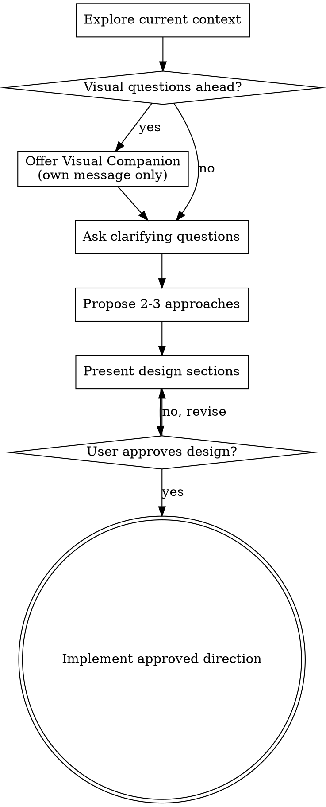

# Brainstorming Ideas Into Designs

Help turn ideas into clear, implementation-ready designs through collaborative dialogue adapted for Factory.

Start by understanding the current context, then ask focused questions one at a time to refine the idea. Once the target is clear, present the design and get approval before any implementation work.

Do NOT write code, edit project files beyond the skill/spec workflow, or take implementation action until the design has been presented and approved.

## Anti-Pattern: "This Is Too Simple To Need A Design"

Every project goes through this process. A tiny config change, a helper function, or a one-screen tweak can still hide assumptions. The design can be short for small work, but it must still be surfaced and approved first.

## Checklist

You MUST create a task for each of these items and complete them in order:

1. **Explore current context** — inspect relevant files, conventions, and existing structure
2. **Offer visual companion** (if upcoming questions are likely visual) — this must be its own message
3. **Ask clarifying questions** — one at a time, to understand purpose, constraints, and success criteria
4. **Propose 2-3 approaches** — include trade-offs and a recommendation
5. **Present design** — in sections scaled to complexity, and get approval
6. **Optionally write spec** — only if the user wants a persistent spec or the task clearly benefits from one
7. **Transition to implementation** — only after approval

## Process Flow

## The Process

**Understanding the idea:**

- Check the current structure first and follow existing patterns
- If the request is too large for a single change, decompose it into smaller parts before refining details
- Ask one question per message when clarification is needed
- Prefer multiple-choice questions when possible
- Focus on purpose, constraints, success criteria, and boundaries

**Exploring approaches:**

- Propose 2-3 approaches with trade-offs
- Lead with your recommendation and explain why
- Keep alternatives realistic and scoped to the existing codebase

**Presenting the design:**

- Present the design once the problem is understood
- Scale each section to the task complexity
- Cover architecture, components, data flow, edge cases, and testing as needed
- Be ready to go back and refine if feedback changes assumptions

**Design for clarity:**

- Break work into small units with clear responsibilities
- Prefer well-defined interfaces and isolated behavior
- Avoid unrelated refactoring unless it directly supports the requested change

## After the Design

- Move to implementation only after the user approves the direction
- If a written spec would help, save it where the user or project expects; do not assume a docs path by default in Factory
- If implementation planning is needed, use the appropriate planning workflow next

## Key Principles

- **One question at a time**
- **Multiple choice preferred**
- **Explore alternatives before settling**
- **Incremental validation**
- **Stay aligned with existing patterns**
- **Do not implement before approval**

## Visual Companion

A browser-based companion can help with mockups, diagrams, and other visual explanations. Offer it only when upcoming questions would genuinely be easier to understand visually.

**Offer text:**
> Some of what we're working on might be easier to explain if I can show it to you in a web browser. I can put together mockups, diagrams, comparisons, and other visuals as we go. This feature is still new and can be token-intensive. Want to try it? (Requires opening a local URL)

This offer must be its own message. If the user declines, continue in text only.
